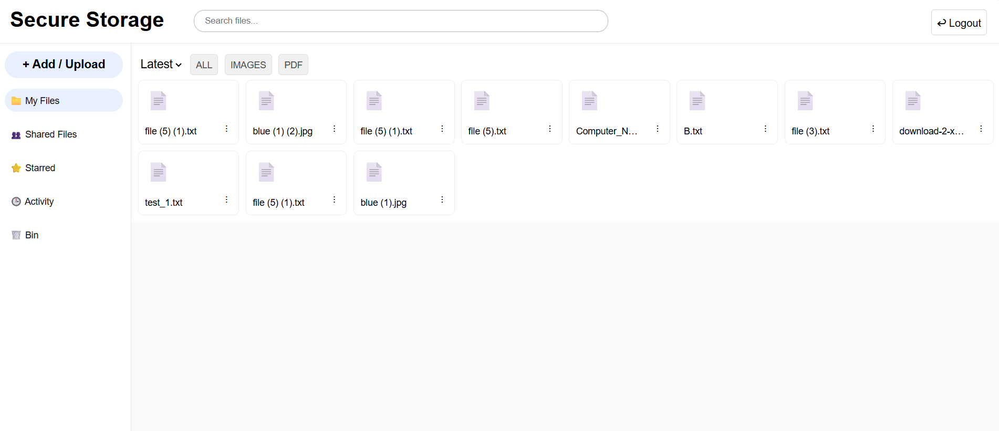

# 🔐 Secure Storage

A Google Drive–like file storage platform built using **Flask, React, IPFS, and Encryption**, ensuring secure, private, and decentralized file management.

---

## 🚀 Project Overview

This system allows users to upload, store, and share files securely using:

- 🔒 **End-to-end encryption**
- 🌐 **Decentralized storage (IPFS)**
- 🔑 **JWT-based authentication**

Even though files are stored on a public network, they remain **private and accessible only to authorized users**.

---

## ⭐ Features

### 🔑 Authentication
- User registration & login
- JWT-based secure authentication
- Auto logout on token expiry

---

### 🔒 Secure File Storage
- Files are encrypted before upload
- Encryption keys are securely managed
- Files decrypted only during download

---

### ☁️ Decentralized Storage (IPFS)
- Files stored using Content Identifier (CID)
- No centralized server dependency
- Faster and distributed access

---

### 📂 File Management
- Upload (drag & drop)
- Download with original filename
- Rename & delete files
- Search & filter files

---

### 🗑️ Bin System
- Soft delete (files moved to Bin)
- Restore within 30 days
- Auto permanent deletion

---

### 🔗 File Sharing
- Share via:
  - Link or QR Code 🔗
  - Username 👤

---

### 📥 Shared Files Page
- View files shared with you
- Shows owner and timestamp
- Empty state UI

---

### 🔔 Notifications
- Reusable message box UI
- Alerts for sharing, upload, session expiry

---

### 📊 Activity Logs
- Track upload, download, delete actions

---

### 🎨 UI/UX
- Google Drive–inspired interface
- Responsive sidebar
- Hover actions
- Drag & drop support

---

## 🛠️ Tech Stack

### Frontend
- React.js
- Axios
- CSS

### Backend
- Flask
- Flask-JWT-Extended
- SQLAlchemy

### Storage & Security
- IPFS (Decentralized Storage)
- AES Encryption

---

## 📁 Project Structure

```
secure-storage/
│
├── backend/
│   ├── routes/
│   ├── models/
│   ├── services/
│   ├── app.py
│
├── frontend/
│   ├── src/
│   ├── components/
│   ├── pages/
│
└── README.md
```

---

## ⚙️ Setup Instructions

### 🔹 Backend

```bash
cd backend
pip install -r requirements.txt
python app.py
```

---

### 🔹 Frontend

```bash
cd frontend
npm install
npm start
```

---

### 🔹 IPFS

Make sure IPFS daemon is running:

```bash
ipfs daemon
```

---

## 🔐 How It Works

1. File is selected by user  
2. File is encrypted locally  
3. Encrypted file is uploaded to IPFS  
4. CID + encrypted key stored in database  
5. On download:
   - File fetched via CID
   - Decrypted using stored key

---

## Preview


---

## 🎯 Future Improvements

- Real-time notifications (WebSockets)
- Role-based permissions (view/edit)
- File preview (PDF, images)
- Access control for secure sharing
- Storage usage analytics
- Multi-device sync

---

## 👨‍💻 Author

Developed by **shk365**

---

## 📌 License

This project is for educational purposes.